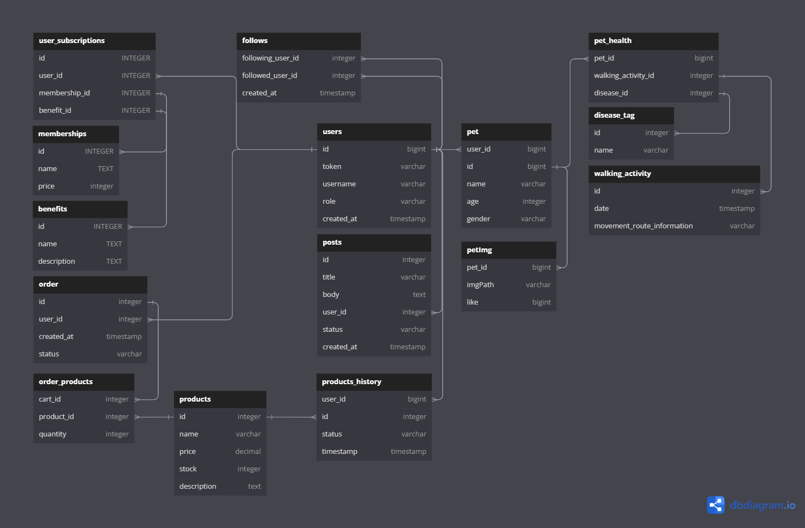

# petCare
Pet Care Project

## 환경 구성
1. cd docker
2. docker-compose up -d
3. spring boot run


### ERD
[ERD 작업중인 주소](https://dbdiagram.io/d/pet-65603bda3be1495787a43f96)

### ERD


### flowChart

> login Flow

```mermaid

flowchart LR

FE(Flutter)
BE(Spring Boot)
Kakao(Login Kakao)
PG(PG DB)

client --> FE --> |login| BE --> | access Req |  Kakao & Naver & PG
Kakao & Naver & PG --> BE
BE --> | Token Return | Client

```

> Pet
